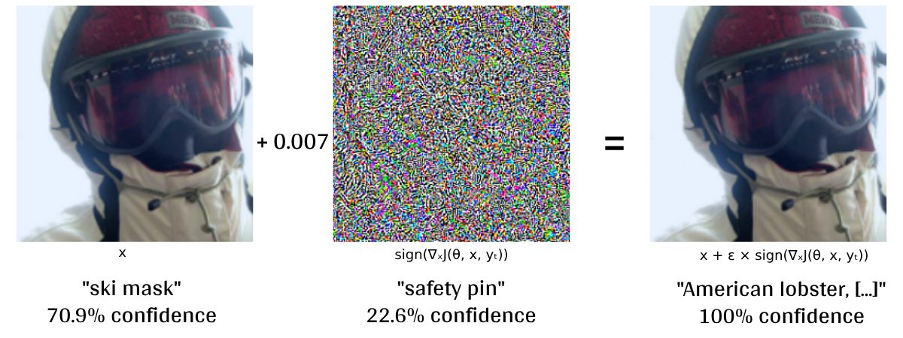

# 🐍🔒 AdversarialAttacks
> **"Fooling Neural Networks: A Comprehensive Benchmark of Adversarial Attacks and Defenses"** - We benchmark FGSM, PGD & CW attacks, and study the effectiveness of state-of-the-art robustness methods.

[](LICENSE.md)
[]()
[](https://github.com/murrodroid/AdversarialAttacks/actions/workflows/tests.yml)
<!-- []()
[](https://murrodroid.github.io/AdversarialAttacks) -->

## Abstract

**missing**

## Overview

> Example result: I-FGSM at ε = 0.007 changes MobileNet confidence on ImageNet-20 class from 70.9% "*ski mask*" to 100% "*american lobster, [...]*"




The project has created methods to evaluate the effectiveness of different attacks, and compare against robustness methods. The codebase is dynamic, meaning any added attacks, datasets or robustness methods etc., should be easy to add and implement into the structure.

<!-- ## Research Objectives -->

## Implemented Attack Methods

### 1. Iterative Fast Gradient Sign Method (I-FGSM)

### 2. Projected Gradient Descent (PGD)

### 3. Carlini-Wagner (CW) Attack

## Supported Models

### Standard Models

- **MobileNet**: Lightweight CNN architecture
- **ResNet**: Residual network with skip connections
- **SWIN**: Swin Transformer

### Specialized Variants

- **Adversarially Trained Models**: Models trained with adversarial examples
- **Robust Models**: Models with architectural adversarial robustness

## Datasets

- **CIFAR-10**: 10-class image classification dataset
- **ImageNet-20**: 20-class subset of ImageNet

## Results

## Installation

### Prerequisites

- Python 3.11
- CUDA-compatible GPU (for optimal performance)

### Easy Setup with Conda (CUDA-compatible)

1. **Clone the repository**

   ```bash
   git clone https://github.com/murrodroid/AdversarialAttacks
   cd AdversarialAttacks
   ```

1. **Setup conda environment**

```bash
conda env create -f environment.yml
conda activate AdvAttacks
```

### Alternative Setup

1. **Clone the repository**

   ```bash
   git clone https://github.com/murrodroid/AdversarialAttacks
   cd AdversarialAttacks
   ```

2. **Install PyTorch with CUDA support**

   ```bash
   pip install torch==2.2.0+cu118 torchvision==0.17.0+cu118 --index-url https://download.pytorch.org/whl/cu118
   ```

3. **Install remaining dependencies**

   ```bash
   pip install -r requirements.txt
   ```

## Usage

### Basic Adversarial Attack Generation

```bash
python adversarialAttack.py --dataset cifar10 --source 8 --target 5 --attack fgsm --epsilon 0.01
```

### Pipeline Execution

```bash
python pipeline.py --dataset imagenet20 --model mobilenet_imagenet20 resnet_imagenet20 --attack fgsm pgd cw --num_images 100 --epsilon 0.015
```

#### Key Parameters

- `--dataset`: Dataset to use (cifar10, imagenet20)
- `--model`: Model architecture(s) to test
- `--attack`: Attack method(s) to use
- `--epsilon`: Perturbation magnitude
- `--num_images`: Number of images per class
- `--iterations`: Number of attack iterations

## Project Structure

```
AdversarialAttacks/
├── src/                    # Source code
│   ├── attacks/           # Attack implementations
│   ├── datasets/          # Dataset loaders
│   ├── finetuning/        # Framework to finetune models
│   ├── models/            # Model definitions
│   └── utils/             # Utility functions
├── statistical_tests/     # Statistical analysis notebooks
├── hpc-results/          # Generated results and metadata
├── tests/                # Unit tests
├── config.py             # Configuration management
├── pipeline.py           # Main execution pipeline
└── adversarialAttack.py  # Basic attack interface
```

**Note**: This project is designed for research purposes. Please ensure compliance with ethical guidelines when using adversarial attacks.
